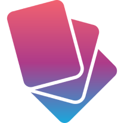

# Flashcard App with Flutter

	

## App Description

Welcome to the Flashcard App, a cross-platform application made using flutter designed to help users in the process of learning by enabling easy access to topics using flashcards. This app leverages third-party libraries like Hive (for data storage), File_Picker (for importing/exporting data), and google_fonts (utilize google fonts) to provide a smooth and user-friendly experience.

### Features

- Flashcard Creation and Customization: Users can create and customize flashcards. They can also organize
  flashcards into different categories(collections) for easy retrieval and grouping.
- Bookmarking: Users have the ability to bookmark any flashcard for easy retrieval and
  later use.
- Import and export: Users can import and export flashcard data for easy sharing between
  users

## App Demo

https://github.com/2STYNe/Flashcard-App-with-Flutter/assets/101346890/78b396aa-6241-48a6-a9c6-3b681de8def1
 

Figma Design: [Design Link](https://www.figma.com/design/kLoNP6U1XlAV4mdSD4OCzV/2STYNE---Flashcard-App?node-id=0-1&t=7zaO5cykSTgkMb4q-0)

Documentation: [Docs Link](Docs/Mobile%20App%20Documentation.pdf)

## Group Members

1. Nebil Rahmeto
2. Solomon Dugasa
3. Tekliye Tamiru
4. Samuel Tadesse
5. Yabets Workaferahu
